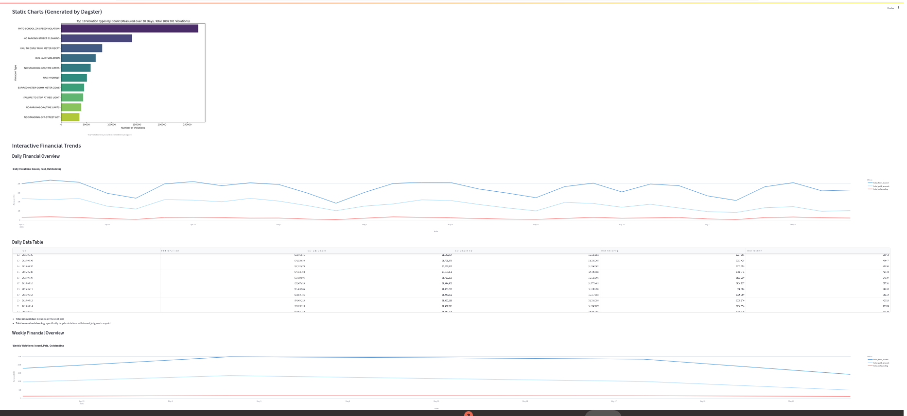

NYC Traffic Violation Financial Analytics Pipeline
A Data Engineering & Analytics Project with Dagster and Streamlit

🚀 Project Overview
This project implements an end-to-end data pipeline using Dagster for orchestration and Streamlit for interactive visualization. It analyzes financial trends from the vast NYC Open Data "Open Parking and Camera Violations" dataset.

The pipeline automates the ingestion, cleaning, aggregation, and presentation of violation data, focusing on key financial metrics like total fines issued, amounts paid, and outstanding balances over time.

✨ Features
Automated Data Ingestion: Daily fetching of raw violation data from NYC Open Data.

Dynamic Date Range: Collects data for a rolling window, specifically from 61 days ago up to 31 days ago relative to the current execution date.

Incremental Data Storage: Raw daily violation data is saved to individual Parquet files (up to 14 missing days are backfilled per run).

Financial Data Processing: Cleans and transforms raw financial columns (fine_amount, payment_amount, amount_due), standardizes violation_status, and classifies outstanding vs. paid violations.

Time-Series Aggregation: Aggregates financial metrics into daily and weekly summaries. The weekly summary includes the number of days contributing to each week.

Data Visualization: Generates static charts (PNG) and provides an interactive dashboard (Streamlit) for exploring financial trends.

Dashboard Insights:

Daily and Weekly trends of Total Fines Issued, Total Paid Amount, and Total Outstanding Amount.

Clarification on financial terms: "Total amount due includes all fines not paid" and "Total amount outstanding specifically targets violations with issued judgments unpaid".

Top 10 violation types by count.

📊 Data Source
The primary data source is the NYC Open Data - Open Parking and Camera Violations dataset.

Note on Data Consistency: This public dataset can exhibit schema inconsistencies and varying data quality across different time periods. The pipeline is designed with robust error handling and explicit column management to mitigate these real-world data challenges.

🏛️ Architecture
This project leverages a modern data stack approach:

Dagster: Used as the orchestrator to define, schedule, and monitor data assets and their dependencies. It manages the flow from raw API ingestion to aggregated financial summaries and static chart generation.

Python with Pandas: Core language and library for data manipulation, cleaning, and aggregation.

Requests & Plotly Express: Used for API interaction and interactive dashboard visualizations.

Parquet Files: Daily raw data is stored in Parquet format for efficient storage and retrieval.

Streamlit: Provides the interactive web dashboard for easy data exploration.

graph TD
    A[NYC Open Data API] --> B{raw_violations_daily asset};
    B --> C[Daily Parquet Files   (data/raw_daily_violations/)];
    C --> D{raw_violations_monthly asset};
    D --> E{cleaned_financial_data asset};
    E --> F{daily_financial_summary asset};
    F --> G{weekly_financial_summary asset};
    F & G --> H{data_visualization assets   (PNG Charts)};
    F & G --> I[Streamlit Dashboard   (Reads Parquet Files)];

🚀 Getting Started Locally
Follow these steps to set up and run the project on your local machine.

Prerequisites
Python 3.8+

pip (Python package installer)

1. Clone the Repository
git clone https://github.com/TJAdryan/dagster_starter_nyc.git
cd dagster_starter_nyc

2. Set up Python Virtual Environment
It's highly recommended to use a virtual environment to manage dependencies.

python3 -m venv .venv
source .venv/bin/activate  # On Windows, use `.\.venv\Scripts\activate`

3. Install Dependencies
Install all required Python packages.

pip install -e ".[dev]"
pip install streamlit plotly-express pyarrow # Explicitly install Streamlit and Plotly for the app

4. Configure DAGSTER_HOME (For Persistent Storage)
This tells Dagster where to store its internal run history and the DuckDB database.

## In your terminal, run this once:
export DAGSTER_HOME=$(pwd)/.dagster_home

## To make it permanent (recommended), add the line above to your ~/.bashrc or ~/.zshrc file
## Then run `source ~/.bashrc`

5. Set up Environment Variables (.env)
Create a file named .env in the root directory of your project (same level as pyproject.toml). This file will store your API key securely.

## .env file content:
NYC_OPEN_DATA_API_KEY=YOUR_NYC_OPEN_DATA_API_KEY_HERE

Replace YOUR_NYC_OPEN_DATA_API_KEY_HERE with your actual NYC Open Data API Key. You can obtain one by registering on the NYC Open Data portal.

DO NOT COMMIT YOUR .env FILE TO GIT! It's already in .gitignore.

6. Run the Dagster Pipeline (To Generate Data)
This is the most critical step. You need to run the Dagster pipeline multiple times to populate your data/raw_daily_violations/ folder with enough daily Parquet files for your desired 61-31 day analysis window.

Start the Dagster UI (Dagit):

dagster dev

This will open Dagit in your browser (usually http://localhost:3000).

Populate Daily Data (Run raw_violations_daily repeatedly):

In Dagit, go to the "Assets" tab.

Find the raw_violations_daily asset.

Click "Materialize asset".

Monitor the logs. Each run will attempt to download data for one missing day starting from 61 days ago (up to 14 days attempted per run).

Repeat this process about 30-31 times (or until raw_violations_daily logs that all data in the 61-31 day range already exists) to fill the data/raw_daily_violations/ directory. This is essential for raw_violations_monthly to have data.

Run the Full Pipeline (for Aggregations and Charts):
Once you have enough daily Parquet files, materialize the full job.

In Dagit, go to the "Assets" tab.

Click the "Materialize all" button for my_full_pipeline_job.

Monitor the "Runs" tab to ensure all steps (raw_violations_monthly, cleaned_financial_data, daily_financial_summary, weekly_financial_summary, and your visualization assets) succeed.

7. Run the Streamlit Dashboard
After your Dagster pipeline has successfully generated the aggregated Parquet files and static charts, you can launch the Streamlit app.

Open a NEW terminal tab/window (keep dagster dev running in the first one).

Navigate to your project root and activate your virtual environment:

cd dagster_starter_nyc
source .venv/bin/activate

Run the Streamlit app:

streamlit run app.py

This will open your interactive dashboard in your web browser (usually http://localhost:8501).

📂 Project Structure
.
├── src/
│   └── my_speed_camera_project/
│       ├── __init__.py               # Marks directory as a Python package
│       ├── definitions.py            # Defines Dagster assets, jobs, schedules
│       ├── data_ingestion.py         # Raw data download from API
│       ├── financial_data_processing.py # Cleans and transforms financial data
│       ├── financial_aggregation.py  # Aggregates daily/weekly summaries
│       ├── data_visualization.py     # Generates static charts
│       └── resources.py              # Defines Dagster resources (e.g., API key)
├── data/
│   ├── raw_daily_violations/         # Stores daily raw Parquet files (ignored by Git)
│   └── aggregated_financial_data/    # Stores aggregated Parquet files for dashboard (committed to Git)
├── results/                          # Stores generated static chart images (committed to Git)
├── .env                              # Environment variables (IGNORED by Git for security)
├── .gitignore                        # Specifies files/folders to ignore in Git
├── app.py                            # Streamlit dashboard application
├── pyproject.toml                    # Project metadata and dependencies
└── README.md                         # This file

